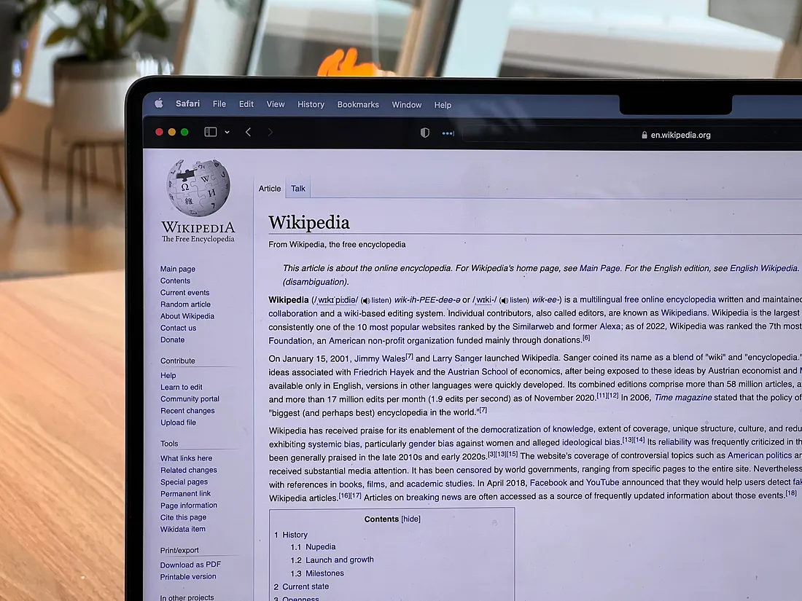

# Wikimedia-Text-Preprocessing-Project

 

## Business Problem

Perform necessary text preprocessing and visualization operations on the **'wikipedia_data.csv'** dataset containing Wikipedia texts.

## Features of Dataset

- **Total Features :** 1
- **Total Row :** 10.859
- **CSV File Size :** 50.6 MB

## Project Steps 

**1. Load the Dataset**

**2. Text Preprocessing**

- Normalazing case folding
- Clean the text (remove punctuation, numbers, unnecessary characters)
- Remove stop words
- Tokenization (split text into words)
- Lemmatization or stemming (optional)

**3. Text Visualization**

- Word Cloud
- Bar chart of most frequent words

**4. Writing All Stages as a Single Function (wiki_preprocess)**
